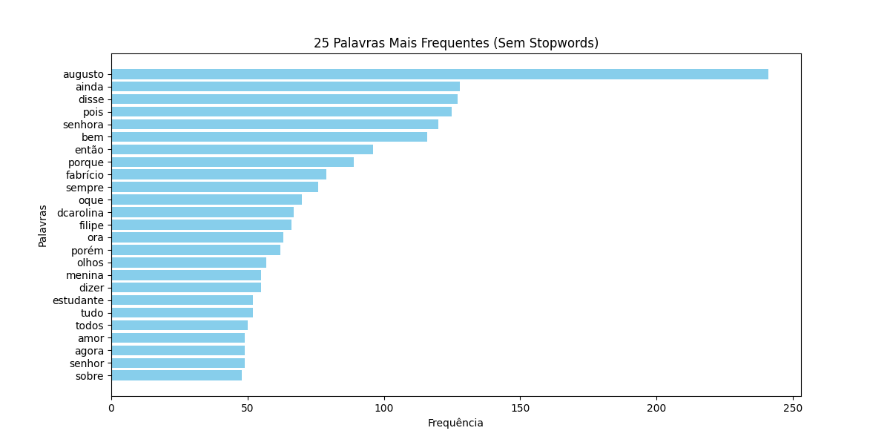

# 📚 Análise de Texto com Processamento de Linguagem Natural (PLN)

## ✨ Introdução
Este projeto realiza a análise de um livro em domínio público (*A Moreninha*, de Joaquim Manuel de Macedo) para estudar a diversidade de palavras e a frequência das palavras mais usadas. Utilizamos Python e bibliotecas de Processamento de Linguagem Natural (PLN) para:

- Extrair texto de um PDF 📝
- Limpar e preprocessar o texto 🌐
- Contar palavras totais e únicas ✔️
- Gerar um **gráfico de palavras mais frequentes** 📊

## 👨‍💻 Tecnologias Utilizadas
- Python 3.x
- **NLTK**: Para tratamento de stopwords
- **PyPDF2**: Para extração de texto do PDF
- **Matplotlib** e **NumPy**: Para visualização de dados
- Expressões Regulares (**re**): Para limpeza do texto

## ⚡ Como Rodar o Projeto
1. Clone o repositório:
   ```sh
   git clone https://github.com/AugustoBuin/nlp-exercises-tc1_1.git
   cd nlp-exercises-tc1_1\src
   ```
2. Instale as dependências:
   ```sh
   pip install -r requirements.txt
   ```
3. Execute o script:
   ```sh
   python index.py
   ```

## 📝 Explicação do Código
1. **Extrai o texto do PDF** usando a biblioteca `PyPDF2`.
2. **Limpa o texto** removendo números, pontuação e deixando tudo em minúsculas.
3. **Remove stopwords** (palavras comuns como "de", "o", "a") usando o `nltk`.
4. **Conta as palavras mais frequentes** e exibe as 25 mais usadas.
5. **Gera um gráfico de barras** mostrando a distribuição das palavras.

## 📊 Exemplo de Saída
### Top 5 Palavras Mais Frequentes (Sem Stopwords)
```
1. augusto: 320
2. fabrício: 250
3. moreninha: 180
4. amor: 160
5. joaninha: 140
```

### 🎨 Gráfico Gerado


## 🎯 Possíveis Melhorias
- Usar **WordCloud** para gerar uma nuvem de palavras.
- Implementar **lemmatization** para agrupar palavras com o mesmo radical.
- Aplicar **classificação de sentimentos** no texto.

---
🛠 Criado por [AugustoBuin](https://github.com/AugustoBuin) | 03/2025

