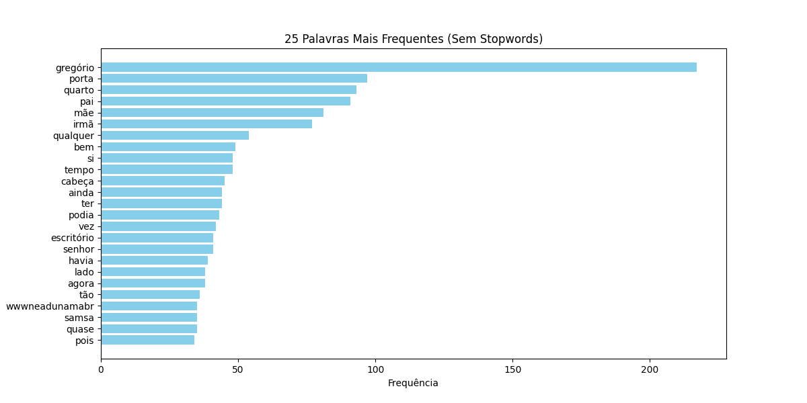

# 📚 Análise de Texto com Processamento de Linguagem Natural (PLN)

## ✨ Introdução
Este projeto realiza a análise de livros em domínio público (*A Moreninha*, de Joaquim Manuel de Macedo, e *A Metamorfose*, de Franz Kafka) para estudar a diversidade de palavras e a frequência das palavras mais usadas. Utilizamos Python e bibliotecas de Processamento de Linguagem Natural (PLN) para:

- Extrair texto de um PDF 📝
- Limpar e preprocessar o texto 🌐
- Contar palavras totais e únicas ✔️
- Calcular a **diversidade lexical** 📖
- Gerar um **gráfico de palavras mais frequentes** 📊

## 👨‍💻 Tecnologias Utilizadas
- Python 3.x
- **NLTK**: Para tratamento de stopwords
- **PyPDF2**: Para extração de texto do PDF
- **Matplotlib** e **NumPy**: Para visualização de dados
- Expressões Regulares (**re**): Para limpeza do texto

## ⚡ Como Rodar o Projeto
1. Clone o repositório:
   ```sh
   git clone https://github.com/AugustoBuin/nlp-exercises-tc1_1.git
   cd nlp-exercises-tc1_1\src
   ```
2. Instale as dependências:
   ```sh
   pip install -r requirements.txt
   ```
3. Execute os scripts, em terminais separados:
   ```sh
   python index.py
   python secondary.py
   ```

## 📝 Explicação do Código
1. **Extrai o texto do PDF** usando a biblioteca `PyPDF2`.
2. **Limpa o texto** removendo números, pontuação e deixando tudo em minúsculas.
3. **Remove stopwords** (palavras comuns como "de", "o", "a") usando o `nltk`.
4. **Conta as palavras mais frequentes** e exibe as 25 mais usadas.
5. **Calcula a diversidade lexical**, que representa a proporção de palavras únicas no texto.
6. **Gera um gráfico de barras** mostrando a distribuição das palavras.

## 📊 Comparação Entre os Livros

### 📖 A Moreninha
- **Total de palavras:** 36.019
- **Palavras únicas:** 11.960
- **Diversidade lexical:** 33,20%

#### Top 5 Palavras Mais Frequentes (Sem Stopwords)
```
1. augusto: 241
2. ainda: 128
3. disse: 127
4. pois: 125
5. senhora: 120
```

### 📖 A Metamorfose
- **Total de palavras:** 19.534
- **Palavras únicas:** 4.071
- **Diversidade lexical:** 20,84%

#### Top 5 Palavras Mais Frequentes (Sem Stopwords)
```
1. gregório: 217
2. porta: 97
3. quarto: 93
4. pai: 91
5. mãe: 81
```

### 🎨 Gráficos Gerados
A Moreninha:

A Metamorfose:


## 🎯 Possíveis Melhorias
- Usar **WordCloud** para gerar uma nuvem de palavras.
- Implementar **lemmatization** para agrupar palavras com o mesmo radical.
- Aplicar **classificação de sentimentos** no texto.

---
🛠 Criado por [AugustoBuin](https://github.com/AugustoBuin) | 03/2025
